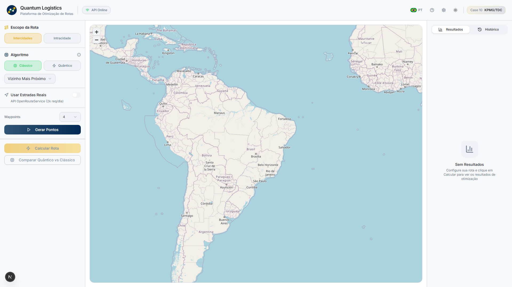
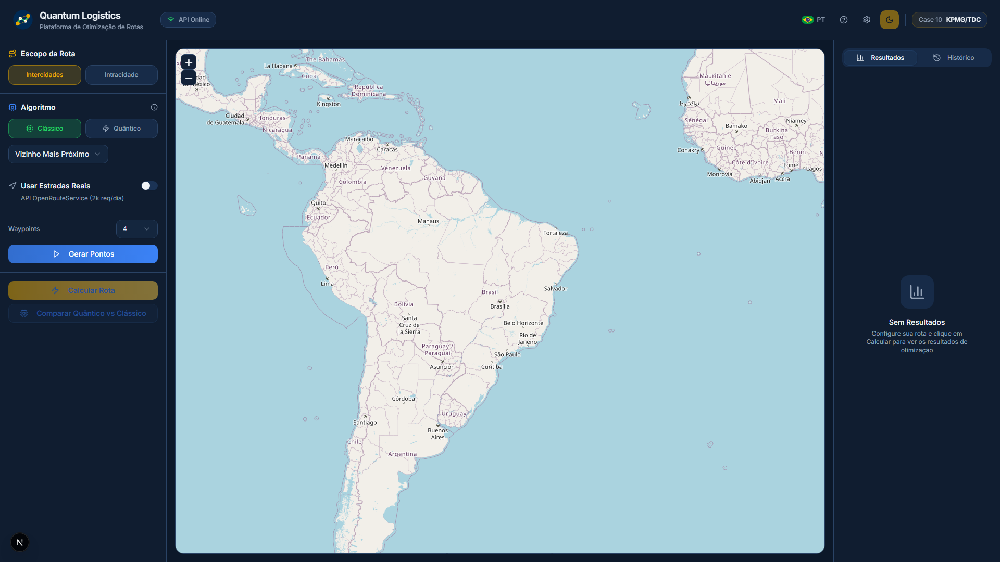
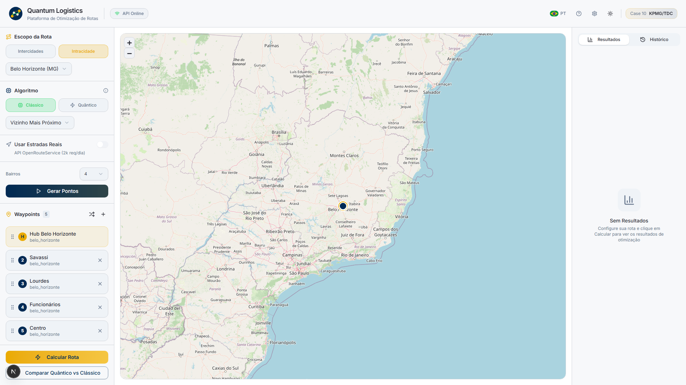
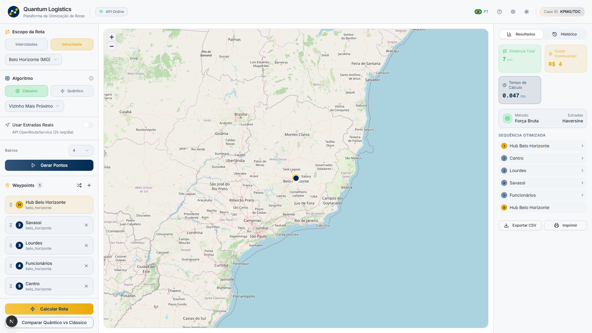
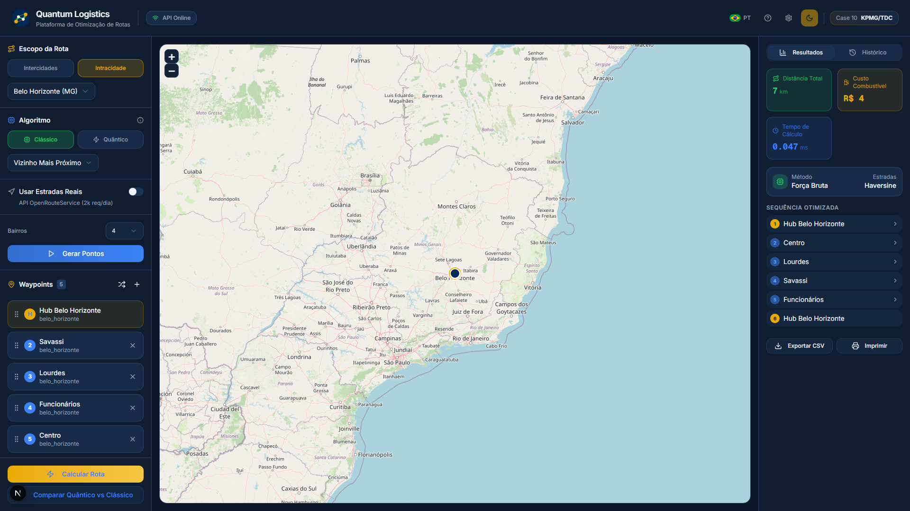
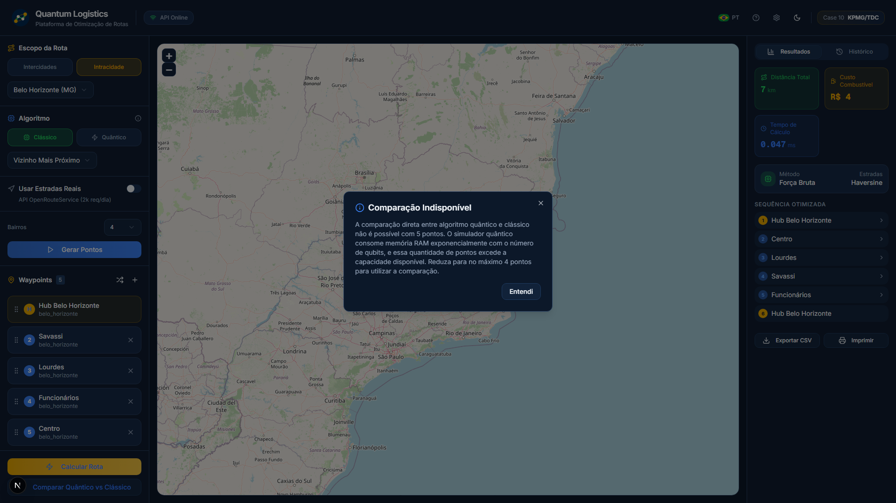

# Quantum Logistics - VRP Solver

[](https://www.python.org/downloads/)
[](https://qiskit.org/)
[](https://flask.palletsprojects.com/)
[](LICENSE)

> **Hybrid quantum-classical optimization for vehicle routing problems using QUBO formulation and QAOA algorithms**

---

## Project Overview

### The Problem
Traditional logistics companies face the **Vehicle Routing Problem (VRP)**: finding the most efficient routes for delivery vehicles while minimizing distance, time, and fuel costs. Classical algorithms struggle with computational complexity as the number of locations grows (NP-hard problem).

### The Solution
This project implements a **hybrid quantum-classical approach** to solve the Traveling Salesman Problem (TSP), a simplified version of VRP:

- **Classical Solver**: Uses traditional algorithms (Brute Force for small instances, NetworkX approximation for larger ones)
- **Quantum Solver**: Translates the problem into QUBO (Quadratic Unconstrained Binary Optimization) format and solves using quantum simulation with Qiskit
- **Real Roads Integration**: Uses OpenRouteService API to calculate routes following actual streets and highways

### Context
Based on **Case 10 from KPMG/TDC Net's Danish Quantum Case Collection**, this project explores practical applications of quantum computing in logistics optimization.

---

## Tech Stack

| Category | Technologies |
|----------|-------------|
| **Language** | Python 3.10+, TypeScript |
| **Quantum Core** | Qiskit, Qiskit Aer, Qiskit Optimization, Qiskit Algorithms |
| **Frontend** | Next.js 16, React, Tailwind CSS, Shadcn/UI, Framer Motion |
| **Maps** | React-Leaflet, Leaflet.js |
| **Backend API** | Flask, Flask-CORS |
| **Classical Algorithms** | NetworkX, NumPy |
| **Geospatial** | Haversine distance, OpenRouteService API |
| **Data Processing** | Pandas, NumPy, Requests |
| **Theming** | next-themes (Light/Dark mode with Ibmec corporate colors) |
| **Configuration** | python-dotenv |

---

## Screenshots

### Light Theme

*Dashboard with Ibmec corporate theme (light mode)*

### Dark Theme

*Professional dark mode interface*

### Route with Waypoints

*Waypoints loaded on the interactive map*

### Route Calculated (Light Mode)

*Optimized route with metrics panel*

### Route Calculated (Dark Mode)

*Same route in dark theme*

### Algorithm Comparison

*Classical vs Quantum algorithm comparison*

---

## Key Features

- **Interactive Map Interface**: Visualize delivery points and optimized routes on an interactive map
- **Dual Routing Modes**:
  - **Inter-City**: Route optimization between Brazilian state capitals (10 cities)
  - **Intra-City**: Route optimization within a single city (neighborhoods)
- **Hybrid Solver**: Switch between classical and quantum algorithms
- **Real Roads Routing**: Calculate routes using actual streets and highways via OpenRouteService API
- **Real-time Metrics Dashboard**:
  - Total distance (km)
  - Estimated travel time (minutes)
  - Estimated fuel cost (BRL)
  - Computation time (ms)
  - Algorithm comparison
- **Route Visualization**:
  - Solid line for real road routes
  - Dashed line for straight-line (Haversine) routes
  - Numbered markers showing route order (1, 2, 3...)
- **10 Brazilian Capitals**: Pre-configured cities for inter-city routing
- **10 Cities for Intra-City**: Each with multiple neighborhoods for testing

---

## Theoretical Background

### Vehicle Routing Problem (VRP)
The VRP is a combinatorial optimization problem asking: *"What is the optimal set of routes for a fleet of vehicles to traverse in order to deliver to a given set of customers?"*

This project focuses on the **Traveling Salesman Problem (TSP)**, where a single vehicle must visit all locations exactly once and return to the depot.

### QUBO Formulation
The TSP is translated into a **Quadratic Unconstrained Binary Optimization** problem:

**Variables**: `x[i,t] ∈ {0,1}` indicates whether city `i` is visited at time `t`

**Constraints** (implemented as penalties):
1. Each city visited exactly once: `∑_t x[i,t] = 1` for all cities `i`
2. Each time slot has exactly one city: `∑_i x[i,t] = 1` for all times `t`

**Objective Function**: Minimize total distance
```
minimize: ∑_{i,j,t} distance[i,j] × x[i,t] × x[j,t+1]
```

### Quantum Algorithms
- **NumPyMinimumEigensolver**: Exact classical eigenvalue solver (for testing)
- **QAOA** (Quantum Approximate Optimization Algorithm): Variational quantum algorithm for combinatorial optimization

---

## Installation & Setup

### 1. Clone the Repository
```bash
git clone https://github.com/igorconrado/quantum_logistics_case10.git
cd quantum_logistics_case10
```

### 2. Create Virtual Environment
```bash
# Windows
python -m venv venv
venv\Scripts\activate

# Linux/Mac
python3 -m venv venv
source venv/bin/activate
```

### 3. Install Dependencies
```bash
pip install -r requirements.txt
```

### 4. Configure Environment Variables
```bash
# Copy the example file
cp .env.example .env

# Edit .env and add your OpenRouteService API key
# Get a free key at: https://openrouteservice.org/dev/#/signup
```

---

## Usage

### Start the Application
```bash
python server.py
```

The application will start at `http://localhost:5000`

Open your browser and navigate to: **http://localhost:5000**

### Step-by-Step Guide

#### Inter-City Mode (Between Capitals)
1. Select **"Between Cities (Inter-municipal)"** in Route Scope
2. Choose a **Depot City** (starting point)
3. Select the number of **Additional Cities** to visit
4. Choose **Algorithm Type** (Classical or Quantum)
5. Click **"Load Inter-City Route"** to generate points
6. (Optional) Enable **"Use Real Roads"** for actual road routing
7. Click **"Calculate Optimized Route"**

#### Intra-City Mode (Within City)
1. Select **"Within City (Intra-municipal)"** in Route Scope
2. Choose a **City** from the dropdown (São Paulo, Rio, etc.)
3. Select the number of **Delivery Points**
4. Choose **Algorithm Type**
5. Click **"Generate Intra-City Route"**
6. (Optional) Enable **"Use Real Roads"**
7. Click **"Calculate Optimized Route"**

### Real Roads Feature
To enable real road routing:
1. Get a free API key from [OpenRouteService](https://openrouteservice.org/dev/#/signup)
2. Add your key to `.env` file: `ORS_API_KEY=your_key_here`
3. Restart the server
4. Check the checkbox **"Use Real Roads"** before calculating

---

## Project Structure

```
quantum_logistics_case10/
│
├── LICENSE                     # MIT License
├── README.md                   # This file
├── requirements.txt            # Python dependencies
├── server.py                   # Flask API server (entry point)
├── .env.example                # Environment variables template
├── .env                        # Environment variables (not in git)
│
├── backend/                    # Core logic modules
│   ├── __init__.py
│   ├── geo.py                  # Geospatial calculations
│   │   ├── Location class
│   │   ├── haversine() distance
│   │   ├── DistanceMatrix class
│   │   ├── SAO_PAULO_TEST_LOCATIONS
│   │   ├── BRAZIL_CAPITALS_LOCATIONS
│   │   └── CITIES_DATA (10 cities with neighborhoods)
│   │
│   ├── classic_solver.py       # Classical algorithms
│   │   ├── solve_tsp_brute_force()
│   │   ├── solve_tsp_nearest_neighbor()
│   │   ├── solve_tsp_networkx()
│   │   └── solve_classic()
│   │
│   ├── quantum_model.py        # QUBO formulation
│   │   ├── build_tsp_qubo()
│   │   └── qubo_to_dict()
│   │
│   ├── quantum_solver.py       # Quantum execution
│   │   ├── solve_quantum()
│   │   ├── decode_quantum_solution()
│   │   └── calculate_route_distance()
│   │
│   └── routing.py              # Real roads routing (NEW)
│       ├── get_real_route()
│       ├── get_distance_matrix_real()
│       ├── get_route_with_geometry()
│       └── OpenRouteService API integration
│
├── static/                     # Static files (CSS, JS)
│   ├── app.js                  # Frontend logic
│   └── styles.css              # Application styles
│
├── templates/                  # HTML templates
│   └── index.html              # Main application page
│
└── tests/                      # Test files
    ├── test_api.py
    ├── test_capitals.py
    ├── test_depot_selection.py
    ├── test_implementation.py
    └── test_point_selection.py
```

---

## Configuration

### Environment Variables (.env)

```bash
# OpenRouteService API Key (required for Real Roads)
ORS_API_KEY=your_api_key_here

# Flask Configuration
FLASK_ENV=development
FLASK_DEBUG=1

# Server Configuration
HOST=0.0.0.0
PORT=5000
```

### Cost Parameters
Based on Brazilian fuel costs (2026):
- Gasoline price: R$ 6.35/liter
- Average consumption: 10 km/liter
- Cost per km: R$ 0.635/km

### OpenRouteService API Limits
- **Free tier**: 2,000 requests/day
- **Matrix endpoint**: Max 50 locations per request
- **Directions endpoint**: Max 50 waypoints per request

### Quantum Simulation Limits

**CRITICAL LIMITATION**: The quantum solver is limited to **4 points maximum** due to exponential RAM memory requirements.

#### Why This Limitation Exists

The `NumPyMinimumEigensolver` creates a Hamiltonian matrix in RAM memory with size **2^(n²) × 2^(n²)** elements, where **n** is the number of points.

**RAM Memory Requirements:**

| Points | Variables (n²) | Matrix Size (2^(n²)) | RAM Required | Feasible? |
|--------|---------------|---------------------|--------------|-----------|
| 3      | 9             | 512                 | ~4 KB        | ✓ Yes     |
| 4      | 16            | 65,536              | ~512 KB      | ✓ Yes     |
| 5      | 25            | 33,554,432          | ~256 MB      | ⚠️ Maybe   |
| 6      | 36            | 68,719,476,736      | **~512 GB**  | ✗ No      |
| 7      | 49            | 562,949,953,421,312 | ~4.5 PB      | ✗✗ No     |

**This limitation does NOT apply to:**
- Real quantum hardware (IBM Quantum, Rigetti, etc.) - uses physical qubits, not RAM simulation
- Classical algorithms (can solve hundreds of points using NetworkX)

---

## API Endpoints

| Endpoint | Method | Description |
|----------|--------|-------------|
| `/` | GET | Main application page |
| `/api/test-data` | GET | Get São Paulo test locations |
| `/api/brazil-capitals` | GET | Get Brazilian capitals data |
| `/api/cities` | GET | Get all available cities |
| `/api/city/<city_key>` | GET | Get specific city data |
| `/api/generate-route` | POST | Generate random route points |
| `/api/calculate` | POST | Calculate optimized route |
| `/api/routing-status` | GET | Check Real Roads API status |
| `/api/set-api-key` | POST | Set OpenRouteService API key |

---

## Testing

### Test Individual Modules

**Test Geospatial Calculations:**
```bash
python backend/geo.py
```

**Test Classical Solver:**
```bash
python backend/classic_solver.py
```

**Test QUBO Formulation:**
```bash
python backend/quantum_model.py
```

**Test Quantum Solver:**
```bash
cd backend && python quantum_solver.py
```

**Test Real Roads Routing:**
```bash
python backend/routing.py
```

### Run All Tests
```bash
pytest test_*.py -v
```

---

## Performance Benchmarks

| # Points | Classical (ms) | Quantum (ms) | RAM Required | Notes |
|----------|---------------|--------------|--------------|-------|
| 3        | ~0.02         | ~19          | ~4 KB        | Both optimal |
| 4        | ~0.02         | ~61          | ~512 KB      | Both optimal |
| 5        | ~0.15         | N/A*         | ~256 MB      | RAM limit |
| 6        | ~1.20         | N/A*         | **~512 GB**  | RAM limit |
| 8        | ~450          | N/A*         | ~2 EB        | RAM limit |
| 10       | ~2100         | N/A*         | Impossible   | RAM limit |

*Quantum solver limited to 4 points due to exponential RAM memory requirements (2^(n²) matrix elements)

---

## References & Credits

### Academic References
1. **Hughes, C., et al.** - *Quantum Computing for the Quantum Curious* (2021)
2. **Farhi, E., et al.** - *A Quantum Approximate Optimization Algorithm* (2014)
3. **KPMG/TDC Net** - *Danish Quantum Cases* - Case 10: Logistics Optimization

### Technologies
- [Qiskit Documentation](https://qiskit.org/documentation/)
- [Flask Documentation](https://flask.palletsprojects.com/)
- [Leaflet.js Documentation](https://leafletjs.com/)
- [NetworkX TSP Algorithms](https://networkx.org/documentation/stable/reference/algorithms/approximation.html)
- [OpenRouteService API](https://openrouteservice.org/dev/#/api-docs)

### Author
**Igor Conrado**
Email: [conradoigor78@gmail.com](mailto:conradoigor78@gmail.com)
LinkedIn: [linkedin.com/in/igorconrado](https://www.linkedin.com/in/igorconrado/)
GitHub: [github.com/igorconrado](https://github.com/igorconrado)

---

## License

This project is licensed under the **MIT License** - see the [LICENSE](LICENSE) file for details.

---

## Future Enhancements

- [ ] Multi-vehicle routing (mTSP)
- [ ] Clustering-based vehicle assignment
- [x] ~~Real-world traffic data integration~~ (Implemented with OpenRouteService)
- [ ] QAOA hyperparameter optimization
- [ ] Deployment to quantum hardware (IBM Quantum)
- [ ] Time windows constraints
- [ ] Vehicle capacity constraints
- [ ] Export routes to GPS formats (GPX, KML)
- [ ] Route history and comparison

---

## Acknowledgments

Special thanks to:
- **KPMG** and **TDC Net** for the inspiring case study
- **Qiskit Team** for the excellent quantum computing framework
- **Flask** and **Leaflet** for making web development simple and powerful
- **OpenRouteService** for the free routing API

---

<div align="center">
Made with quantum computing
</div>
